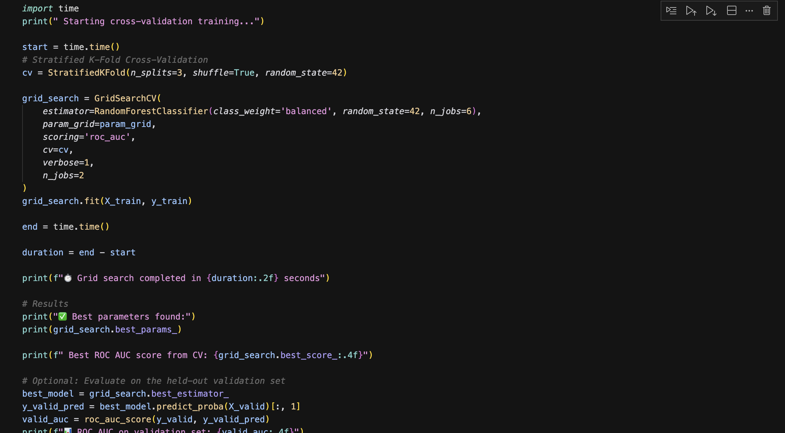

## Can you predict the next big security incident before it happens?

## Overview

This repository contains Microsoft_Security.ipynb, a Jupyter Notebook that walks through an end‑to‑end workflow for turning raw Microsoft security alert telemetry into a binary incident‑grade classifier. The goal is to distinguish TruePositive (confirmed threat) alerts from False Positive noise so that analysts can focus on what matters.

Key steps covered:

Data ingestion & light cleaning of >9 million alert records

Exploratory Data Analysis (EDA) with visualisations 

Feature engineering for MITRE techniques, geographic codes, timestamps, roles, and alert metadata

Model development using a RandomForestClassifier with class balancing & hyper‑parameter tuning (grid search + cross‑validation)

Performance evaluation with ROC‑AUC and feature‑importance inspection

Practical notes & lessons learned for handling very large security datasets

###  The Data is 9 Million Rows and 46 Columns
####  www.kaggle.com/datasets/Microsoft/microsoft-security-incident-prediction/data

Training performed on: University of Sabine, HPC Cluster

Cluster name: Sabine Cluster

Resources used:

CPU cores: 6 cores for RandomForestClassifier (n_jobs=6)

Grid search parallelism: 2 concurrent jobs (n_jobs=2 in GridSearchCV)

Cross-validation: 3-fold stratified (StratifiedKFold)

